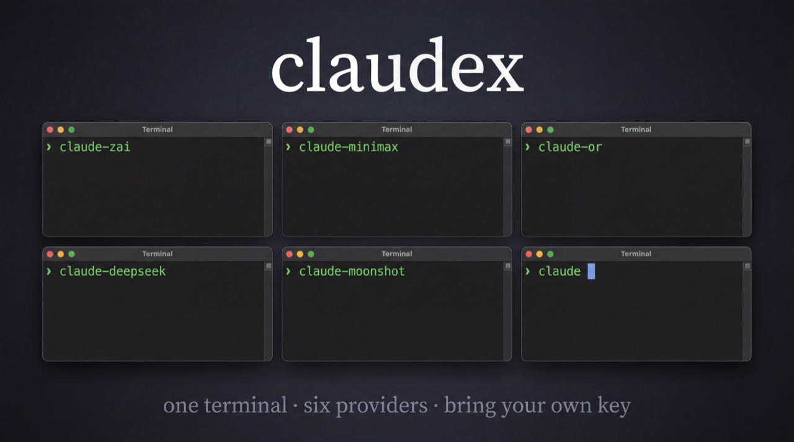

<p align="center">
  
</p>

# claudex

> **Claude Code'u tek terminalden çoklu hesap + çoklu sağlayıcı (Anthropic, Z.ai, MiniMax, DeepSeek, Moonshot, OpenRouter…) ile kullan. Kendi key'lerini getir.**

`claudex`, [Claude Code](https://www.anthropic.com/claude-code)'un kendi `ANTHROPIC_BASE_URL` / `CLAUDE_CONFIG_DIR` env override mekanikleri üzerine kurulu — **proxy yok, router yok**. Tek komutla yeni bir `claudeX` alias'ı eklersin: kendi API key'ini girersin, sağlayıcıyı + modeli seçersin, hazır.

[English version below ↓](#english)

---

## 🇹🇷 Türkçe

### Neden?

- Anthropic abonelik rate-limit'ini iki katına çıkarmak (multi-account)
- DeepSeek / Z.ai / MiniMax gibi **çok daha ucuz veya ücretsiz** modelleri Claude Code üzerinden kullanmak
- Her şey Claude Code'un kendi UI/skill/MCP/agent dünyasında, sadece arkadaki model değişiyor

### Önkoşullar

| Gereken | Nasıl yüklerim |
|---|---|
| Node.js 20+ | https://nodejs.org/ |
| Claude Code | `npm install -g @anthropic-ai/claude-code` |
| zsh veya bash | macOS / Linux'ta default |

### Kurulum (30 saniye)

```bash
git clone https://github.com/mertapp1122/claudex.git
cd claudex
npm install && npm run build && npm link
claudex init
```

> ℹ️ `npm install -g claudex` yayını yakında. Şimdilik `git clone`.

### İlk profil (kılavuzlu)

```bash
claudex quickstart
```

Z.ai → MiniMax → OpenRouter sırasıyla ilerler. Her birinde:
- Key URL'sini gösterir (kayıt → API key oluştur)
- Key'i yapıştırırsın (gizli)
- "Atlamak istiyorum" → enter → atlanır
Bittiğinde `source ~/.zshrc` → `claude-zai` (veya `claude-minimax`, `claude-or`) yazınca Claude Code başlar.

### Hangi modeli seçeyim?

```bash
claudex recommend
```

İnteraktif: "Ne yapmak istiyorsun?" → 8 use-case (hızlı kod / refactor / uzun context / vision / …). Top-3 öneriyi rationale'la birlikte gösterir, kuracağın komutu yazdırır.

Veya non-interactive:
```bash
claudex recommend coding-fast --json
```

### Karar ağacı

```
Ücretsiz?
├── Süresiz ücretsiz model → claudex add <name> --provider zai
├── 32 ücretsiz modelin biri → claudex add <name> --provider openrouter
└── Trial (Kasım 7 2026'a kadar) → claudex add <name> --provider minimax

Ucuz ödemeli?
└── DeepSeek (~10x Sonnet'ten ucuz) → claudex add <name> --provider deepseek

Resmi Anthropic (multi-account izolasyon)?
└── claudex add <name> --provider anthropic --no-share
```

### Tüm komutlar

```bash
claudex init                       # ilk kurulum (~/.claudex + shell rc block)
claudex quickstart                 # 3 ücretsiz sağlayıcı için kılavuzlu setup
claudex recommend [<intent>]       # ne yapmak istediğine göre top-3 model önerisi
claudex add <isim> [-p <provider>] # yeni alias (interactive)
claudex validate <isim>            # 1-token ping ile key + model doğrula
claudex list                       # tüm profilleri listele
claudex remove <isim>              # alias kaldır
claudex providers [info <id>]      # sağlayıcı kataloğu
claudex export <isim> [-o file]    # redacted JSON template (key olmadan)
claudex import <file>              # template'i yükle, key sor, profil oluştur
claudex doctor                     # kurulum sağlığı
claudex --lang en                  # İngilizce output
```

### Bundled sağlayıcılar

| ID | Tier | Site | Default |
|----|------|------|---------|
| `anthropic` | Resmi | https://console.anthropic.com | (default) |
| `zai` | **ÜCRETSİZ FOREVER** | https://z.ai | GLM-4.7-Flash |
| `minimax` | **ÜCRETSİZ TRIAL** (Kasım 7 2026) | https://platform.minimax.io | M2.7 |
| `deepseek` | Ucuz ödemeli | https://platform.deepseek.com | deepseek-v4-pro |
| `moonshot` | Ödemeli (long-context uzmanı) | https://platform.moonshot.ai | Kimi K2.5 |
| `openrouter` | 32 ücretsiz model | https://openrouter.ai | qwen3-coder:free |

Hepsi **Anthropic-uyumlu** endpoint'lere sahip — proxy gerek yok. Detay → [docs/PROVIDERS.md](docs/PROVIDERS.md).

### Nasıl çalışıyor?

Claude Code 5 env değişkenine bakar:
- `CLAUDE_CONFIG_DIR` — sessions, history, kullanıcı state'i nereye yazılsın
- `ANTHROPIC_BASE_URL` — API endpoint (default: api.anthropic.com)
- `ANTHROPIC_AUTH_TOKEN` — endpoint'in key'i
- `ANTHROPIC_MODEL`, `ANTHROPIC_SMALL_FAST_MODEL` — main + small modeller

`claudex add` her profil için bir shell function üretir. Function `.env`'den key'i okur, env'leri set eder, `claude` binary'sini çağırır. Key argv'de görünmez, history'e düşmez.

### Dosya yapısı

```
~/.claudex/
├── profiles/<isim>/
│   ├── .env                # API key (mode 0600)
│   └── (CLAUDE_CONFIG_DIR — symlink veya isolated)
├── generated/aliases.sh    # ~/.zshrc tarafından source edilir
└── backups/                # her rc edit'inde otomatik backup
```

Mevcut `~/.claude/` ile paylaşım: default olarak agents/commands/skills/plugins/CLAUDE.md/settings.json/mcp.json **symlink** edilir → her profilde aynı tooling. `--no-share` ile tamamen izole profile.

### Güvenlik

- Key'ler `~/.claudex/profiles/<isim>/.env`, mode 0600
- `claudex` repo'ya hiçbir key commit edilmez (otomatik `.gitignore`)
- Detay → [docs/SECURITY.md](docs/SECURITY.md)

### Yeni sağlayıcı eklemek

[`src/templates/providers.json`](src/templates/providers.json)'a JSON entry ekle, PR aç. Kod değişmez. Detay → [CONTRIBUTING.md](CONTRIBUTING.md).

### Roadmap (v0.3+)

- `claudex bench` — profilleri latency/cost karşılaştır
- macOS Keychain encrypted secrets (opt-in)
- Cost tracking — Claude Code log'larından token sayımı
- Tab completion (zsh/bash/fish)
- Anthropic-uyumlu olmayan sağlayıcılar (Groq, Gemini direkt) için claude-code-router proxy modu

### Yasal uyarı

`claudex` **bağımsız** bir açık-kaynak araçtır. Anthropic, Z.ai, MiniMax, DeepSeek, Moonshot, OpenRouter veya başka bir sağlayıcı tarafından desteklenmez veya onaylanmaz. Sağlayıcı kullanım koşullarına uymak senin sorumluluğun.

---

## English

### Why?

- Double your Anthropic subscription rate limit (multi-account)
- Use **much cheaper or free** models (DeepSeek, Z.ai, MiniMax, OpenRouter…) inside Claude Code
- Everything stays in Claude Code's UI/skills/MCP/agent ecosystem; only the model behind it changes

### Prerequisites

- Node.js 20+ — https://nodejs.org/
- Claude Code — `npm install -g @anthropic-ai/claude-code`
- zsh or bash

### Install (30 seconds)

```bash
git clone https://github.com/mertapp1122/claudex.git
cd claudex
npm install && npm run build && npm link
claudex init
```

> ℹ️ `npm install -g claudex` publish coming soon. For now: git clone.

### First profile (guided)

```bash
claudex quickstart
```

Walks you through Z.ai → MiniMax → OpenRouter (skip any). When done: `source ~/.zshrc`, then `claude-zai` (or `claude-minimax`, `claude-or`) launches Claude Code with the new model.

### Which model?

```bash
claudex recommend
```

Interactive: "What do you want to do?" → 8 use cases (fast coding / refactor / long context / vision / …). Shows top-3 with rationale and the install command.

Non-interactive:
```bash
claudex recommend coding-fast --json
```

### Decision tree

```
Free?
├── Forever-free model → claudex add <name> --provider zai
├── One of 32 free models → claudex add <name> --provider openrouter
└── Trial (until Nov 7 2026) → claudex add <name> --provider minimax

Cheap paid?
└── DeepSeek (~10x cheaper than Sonnet) → claudex add <name> --provider deepseek

Official Anthropic (multi-account)?
└── claudex add <name> --provider anthropic --no-share
```

### Commands

```bash
claudex init                        # initial setup (~/.claudex + shell rc block)
claudex quickstart                  # guided setup of 3 free providers
claudex recommend [<intent>]        # top-3 model suggestions per use case
claudex add <name> [-p <provider>]  # add an alias (interactive)
claudex validate <name>             # ping the provider with a 1-token test
claudex list                        # list all profiles
claudex remove <name>               # remove alias
claudex providers [info <id>]       # provider catalog
claudex export <name> [-o file]     # redacted JSON template (no key)
claudex import <file>               # load template, prompt for key
claudex doctor                      # health check
claudex --lang tr                   # Turkish output
```

### Disclaimer

`claudex` is an independent open-source tool. **Not affiliated with, endorsed by, or sponsored by Anthropic, Z.ai, MiniMax, DeepSeek, Moonshot, OpenRouter, or any other provider.** Compliance with each provider's terms of service is your responsibility.

### License

[MIT](LICENSE)
